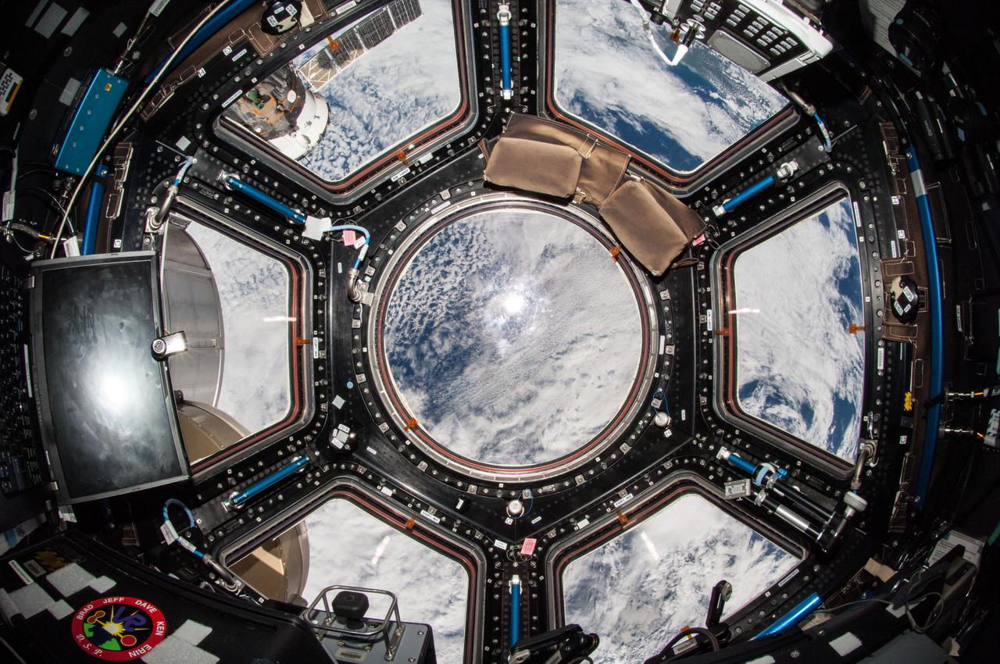

# 🚀 AstroPass - NASA Space Apps Challenge 2025

[](https://opensource.org/licenses/MIT)
[](https://reactjs.org/)
[](https://vitejs.dev/)
[](https://www.spaceappschallenge.org/)

> **An immersive astronaut training and space exploration experience built for NASA Space Apps Challenge 2025**

AstroPass is a cutting-edge web application that brings the wonders of space exploration to your fingertips. Experience life as an astronaut through interactive training simulations, educational content, and stunning visualizations of Earth from space.


*The main homepage showcasing all available space experiences*

## 📖 Table of Contents

- [🌟 Features](#-features)
- [🖼️ Project Gallery](#️-project-gallery)
- [🛠️ Tech Stack](#️-tech-stack)
- [🚀 Quick Start](#-quick-start)
- [📁 Project Structure](#-project-structure)
- [🎮 Game Modules](#-game-modules)
- [🔧 Development](#-development)
- [🏗️ Deployment](#️-deployment)
- [♿ Accessibility](#-accessibility)
- [📱 Responsive Design](#-responsive-design)
- [🤝 Contributing](#-contributing)
- [👥 Team](#-team)
- [📄 License](#-license)

## 🌟 Features

### 🌍 **Cupola Earth Observatory**
Experience Earth observation from the International Space Station's Cupola module. Explore breathtaking views of our planet with:
- Real-time Earth viewing simulation
- Interactive zoom controls
- NASA Earth observation data integration
- Stunning photography from space


*Interactive Earth observation from the ISS Cupola window*

### 🏊‍♂️ **NBL (Neutral Buoyancy Laboratory) Training**
Train like a real astronaut in our weightlessness simulation:
- Realistic underwater training environment
- Interactive controls and movement
- Educational content about astronaut preparation
- Immersive 3D-like experience


*Astronaut training simulation in the Neutral Buoyancy Laboratory*

### 📚 **Interactive Astronaut Stories**
Embark on a choose-your-own-adventure journey through space:
- 6-part interactive story modules
- Role selection (Commander, Pilot, Mission Specialist)
- Smart quizzes with educational content
- Memory games and challenges
- Real astronaut experiences and scenarios


*Interactive storytelling with multiple choice decisions*

### 📖 **Digital Space E-Book**
"Orbiting the Void: An Astronaut's Life" - A comprehensive digital experience:
- Full PDF reader integration
- Audio narration (podcast version)
- Stunning space photography
- Personal astronaut stories and insights


*Digital e-book with audio narration capabilities*

## 🖼️ Project Gallery

### Homepage Overview

*Clean and intuitive feature cards showcasing all available experiences*

### Story Adventure System

*Role selection interface for the interactive story experience*


*In-story decision making with educational quizzes*

### Earth Observation Gallery

*Aurora Borealis viewed from the International Space Station*


*Earth at night showing city lights and human activity*


*Solar eclipse shadow captured from space*

### NBL Training Environment

*Training controls and underwater environment simulation*

### Developer Team

*Meet the talented team behind AstroPass*

## 🛠️ Tech Stack

### Frontend Framework
- **React 18.3.1** - Modern component-based UI library
- **React Router DOM 6.30.1** - Client-side routing
- **Vite 7.1.9** - Lightning-fast build tool and dev server

### State Management & Performance
- **TanStack React Query 5.83.0** - Server state management
- **React.lazy & Suspense** - Code splitting and lazy loading
- **React.memo** - Component memoization for performance

### Graphics & Visualization
- **GL Matrix 3.4.4** - WebGL matrix operations for 3D graphics
- **Custom CSS animations** - Smooth transitions and effects

### Development Tools
- **ESLint 9.32.0** - Code linting and formatting
- **PropTypes** - Runtime type checking
- **FontAwesome 6.5.1** - Icon library

### Build & Deployment
- **Vite Build System** - Optimized production builds
- **Code Splitting** - Automatic chunk optimization
- **Asset Optimization** - Image and video compression

## 🚀 Quick Start

### Prerequisites
- **Node.js** (v18 or higher)
- **npm** or **yarn**
- **Git**

### Installation

```bash
# Clone the repository
git clone https://github.com/Ahmedloay2/FrontEnd-Nasa.git

# Navigate to project directory
cd FrontEnd-Nasa/code

# Install dependencies
npm install

# Start development server
npm run dev
```

The application will be available at `http://localhost:5173`

### Environment Setup
Create a `.env` file in the `/code` directory:
```env
VITE_APP_TITLE=AstroPass
VITE_APP_DESCRIPTION=NASA Space Apps Challenge 2025
VITE_API_BASE_URL=your_api_url_here
```

## 📁 Project Structure

```
code/
├── public/                     # Static assets
│   ├── earth2.mp4             # Earth rotation video
│   ├── Game/                  # Game-specific assets
│   └── audio/                 # Audio files
├── src/
│   ├── components/            # Reusable UI components
│   │   ├── layout/           # Layout components (Navbar, Footer)
│   │   ├── ui/               # UI components (FeatureCard, LoadingSpinner)
│   │   ├── ErrorBoundary/    # Error handling
│   │   └── Developers/       # Team information
│   ├── pages/                # Main application pages
│   │   ├── Home/             # Landing page
│   │   ├── CupolaEarth/      # Earth observation module
│   │   ├── Story/            # Interactive stories
│   │   ├── EBook/            # Digital book reader
│   │   ├── NBLGame/          # Training simulation
│   │   └── NotFound/         # 404 page
│   ├── assets/               # Images, videos, and media
│   ├── styles/               # Global CSS styles
│   ├── App.jsx               # Main application component
│   └── main.jsx              # Application entry point
├── Dockerfile                # Container configuration
├── nginx.conf               # Production server config
├── package.json             # Dependencies and scripts
└── vite.config.js          # Build configuration
```

## 🎮 Game Modules

### 1. Cupola Earth Observatory
**Location**: `/cupola-earth`
- Interactive Earth viewing from ISS
- Zoom and pan controls
- Educational content about Earth science
- NASA imagery integration

**Key Features**:
- Real-time Earth rotation simulation
- Multiple viewing modes
- Educational overlays
- Photography gallery

### 2. NBL Training Simulation
**Location**: `/nbl-game`
- Underwater astronaut training simulation
- Realistic movement controls
- Educational content about spacewalk preparation
- Progress tracking

**Game Mechanics**:
- WASD movement controls
- Physics-based interactions
- Training objectives
- Performance scoring

### 3. Interactive Story Adventure
**Location**: `/story`
- Choose-your-own-adventure format
- Multiple story paths and endings
- Educational quizzes integrated
- Memory challenges

**Story Elements**:
- Character role selection
- Decision-based branching
- Educational content delivery
- Progress saving

## 🔧 Development

### Available Scripts

```bash
# Development
npm run dev              # Start development server
npm run build           # Production build
npm run preview         # Preview production build

# Code Quality
npm run lint            # Run ESLint
npm run lint:fix        # Fix linting issues
npm run health-check    # Full project health check

# Deployment
npm run deploy:netlify  # Deploy to Netlify
npm run deploy:vercel   # Deploy to Vercel
```

### Development Guidelines

1. **Component Structure**: Use functional components with hooks
2. **Performance**: Implement React.memo for all components
3. **Accessibility**: Follow WCAG 2.1 AA guidelines
4. **Code Style**: Follow ESLint configuration
5. **Testing**: Write unit tests for critical components

### Adding New Features

1. Create component in appropriate `/src/components` or `/src/pages` directory
2. Add routing in `App.jsx` if needed
3. Implement lazy loading for page components
4. Add PropTypes for type checking
5. Include accessibility attributes
6. Update navigation if required

## 🏗️ Deployment

### Production Build
```bash
npm run build
```

### Deployment Options

#### Netlify
```bash
npm run deploy:netlify
```

#### Vercel
```bash
npm run deploy:vercel
```

#### Docker
```bash
# Build Docker image
docker build -t astropass .

# Run container
docker run -p 80:80 astropass
```

### Performance Optimizations
- **Code Splitting**: Automatic route-based splitting
- **Asset Optimization**: Compressed images and videos
- **Lazy Loading**: Components loaded on demand
- **Memoization**: Optimized re-renders
- **Bundle Analysis**: Monitor chunk sizes

## ♿ Accessibility

AstroPass is built with accessibility as a priority:

- **WCAG 2.1 AA Compliant**
- **Screen Reader Support** - ARIA labels and semantic HTML
- **Keyboard Navigation** - Full keyboard accessibility
- **High Contrast** - Accessible color schemes
- **Focus Management** - Clear focus indicators
- **Reduced Motion** - Respects user preferences

## 📱 Responsive Design

- **Mobile First** - Optimized for all devices
- **Flexible Grid** - CSS Grid and Flexbox layouts
- **Touch Friendly** - Large interactive areas
- **Performance** - Optimized for mobile networks

## 🤝 Contributing

We welcome contributions! Please see our [Contributing Guidelines](CONTRIBUTING.md) for details.

### Development Process
1. Fork the repository
2. Create a feature branch
3. Make your changes
4. Add tests if applicable
5. Submit a pull request

### Code of Conduct
Please read our [Code of Conduct](CODE_OF_CONDUCT.md) before contributing.

## 👥 Team

**AstroPass Development Team**


*The dedicated team behind AstroPass*

### Core Developers
- **Frontend Lead** - React architecture and UI/UX
- **Game Developer** - Interactive modules and simulations  
- **Content Creator** - Educational content and storytelling
- **Designer** - Visual design and user experience

*Special thanks to NASA for providing inspiration and educational content.*

## 📄 License

This project is licensed under the MIT License - see the [LICENSE](LICENSE) file for details.

---

## 🚀 Ready to Explore Space?

Experience the wonders of space exploration with AstroPass. Whether you're training like an astronaut, observing Earth from the ISS, or diving into interactive space stories, AstroPass offers an unforgettable journey through the cosmos.

**[🌟 Launch AstroPass](https://your-deployed-url.com)**

*Built with ❤️ for NASA Space Apps Challenge 2025*

---

### Quick Links
- [🐛 Report Bug](https://github.com/Ahmedloay2/FrontEnd-Nasa/issues)
- [💡 Request Feature](https://github.com/Ahmedloay2/FrontEnd-Nasa/issues)
- [📧 Contact Team](mailto:your-email@example.com)
- [🌟 NASA Space Apps](https://www.spaceappschallenge.org/)